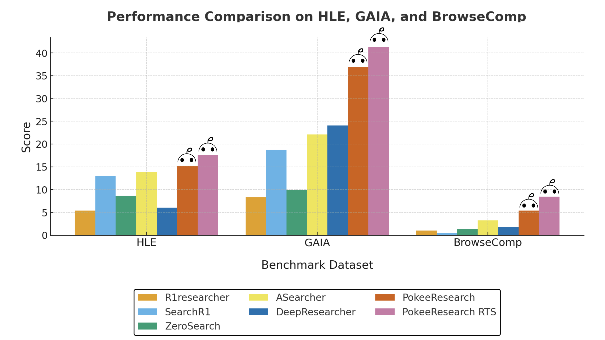
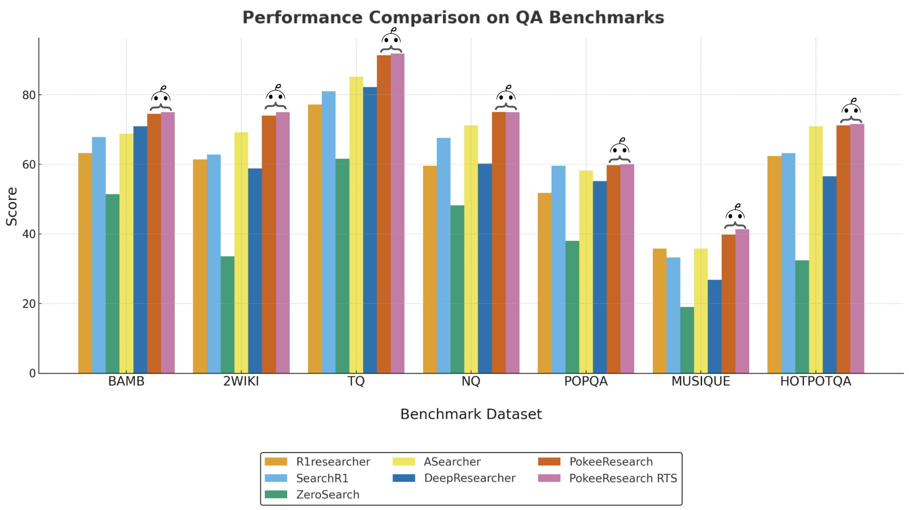

This repository hosts Pokee’s state-of-the-art 7B DeepResearch Agent, which integrates web search and content reading capabilities to answer complex questions using the most up-to-date information available online.

*We also offer an API hosting our proprietary deep research agent, which is up to 75% cheaper than OpenAI, Gemini, and Perplexity. It delivers comprehensive, citation-rich research reports with no hidden costs and no API key management required. (For more information about the API, visit [pokee.ai/deepresearch-preview](https://pokee.ai/deepresearch-preview))*

<div align="center">

[](https://github.com/Pokee-AI/PokeeResearchOSS)
[](https://arxiv.org/pdf/2510.15862)
[](https://huggingface.co/PokeeAI/pokee_research_7b)

[](https://linkedin.com/company/pokee-ai)
[](https://x.com/pokee_ai)
[](https://discord.gg/VJXWQvyd)
[](https://i.postimg.cc/wv099v5w/wechat-group-pokee.jpg)


<p style="text-align:center;">
  <a href="https://pokee.ai" target="_blank" rel="noopener noreferrer"><strong>pokee.ai</strong></a>
</p>

</div>

# PokeeResearch-7B Agent

Pokee's state-of-the-art 7B DeepResearch Agent that leverages web search and content reading capabilities to answer complex questions using the most up-to-date information available online.
<div align="center">

</div>
<div align="center">

</div>

## 🚀 Features

- **Multi-turn Research**: Performs iterative web searches and content analysis
- **Tool Integration**: Seamlessly integrates web search, content reading, and browsing tools
- **Comprehensive Evaluation**: Includes benchmark evaluation across multiple QA datasets
- **High Performance**: Achieves superior results on complex reasoning tasks
- **Scalable Architecture**: Built on efficient 7B parameter model for optimal performance


## 📋 Requirements

### Hardware
- **Compute Node**: We tested the code on a single 80GB A100 GPU (GPUs with less memory may also work, though we have not tested them). Using multiple GPUs can further accelerate inference. For reference, the driver version is 570.133.20 and the CUDA toolkit version is 12.8.

### Software
- **Docker**: Environment to run the code will be provided as a docker image.

### API Keys
You will need the following API keys:
- **Serper API**: For web search functionality
- **Jina API**: For web content reading and extraction
- **Gemini API**: For content summarization and result evaluation
- **HuggingFace Token**: For downloading the model from HuggingFace

## 🛠️ Quick Start

### 1. Environment Setup
We provide a Docker image for easy deployment:
```bash
docker pull verlai/verl:app-verl0.5-transformers4.55.4-sglang0.4.10.post2-mcore0.13.0-te2.2
docker create --runtime=nvidia --gpus all --net=host --shm-size="80g"  -v .:/workspace/ --name pokeeresearch verlai/verl:app-verl0.5-transformers4.55.4-sglang0.4.10.post2-mcore0.13.0-te2.2 sleep infinity
docker start pokeeresearch
docker exec -it pokeeresearch  bash
ssh-keygen -t ed25519 -C <USER_NAME>
# copy /root/.ssh/id_ed25519.pub to github ssh keys
git clone git@github.com:Pokee-AI/PokeeResearchOSS.git --recursive
cd PokeeResearchOSS
pip install colorlog
pip install -U google-genai
hf auth login # enter your huggingface token, the tokens needs to have permission to use Pokee AI's models
cd verl
pip install -e .
cd ..
```

Create a `.env` file in the project root and add your API keys:
```bash
SERPER_API_KEY=your_serper_api_key_here
JINA_API_KEY=your_jina_api_key_here
GEMINI_API_KEY=your_gemini_api_key_here
```

### 2. Modify ```run.sh``` to use more than one GPUs (optional)
Running the experiment with more GPUs is faster. By default the experiment uses one GPU.
If you want to use more GPUs, simply modify 
```bash
trainer.n_gpus_per_node=1 \
```
in ```run.sh``` to 
```bash
trainer.n_gpus_per_node=<NUM_GPUS_TO_USE> \
```
### 3. Run Benchmark Evaluation

**Step 1: Start the Tool Server**
```bash
python start_tool_server.py \
--port <PORT_NUMBER> \ # to specify the port to listen to (default 8888)
--enable-cache # to enable caching tool results (recommended to save api credits)
```

**Step 2: Run the Evaluation**

Start a new terminal, then run the experiment.
```bash
docker exec -it pokeeresearch bash
cd PokeeResearchOSS
bash run.sh
```

**Evaluation Details:**
- **Dataset Size**: 1,228 questions with ground truth answers
- **Evaluation Runs**: 4 samples per question
- **Metrics**: Mean accuracy across all responses
- **Judge Model**: Gemini-2.5-Flash-lite
- **Runtime**: 40-50 minutes on 8 × A100 80GB GPUs

### 4. View Results
Detailed results are available in the `val_results/` directory:
- Original questions and ground truth answers
- Agent's complete research trajectory
- Judge's evaluation decisions and reasoning

### 5. Research Threads Synthesis
Users may synthesize the research threads saved in `val_results/`. To do so, replace `xxxx.json` in `run_rts.sh` by the result json file in `val_results/`.
Then run `bash run_rts.sh`.

### 6. Launch the Deep Research Agent App
We provide both a CLI app and a GUI app based on [Gradio](https://www.gradio.app/).
Both apps support serving the LLM locally or via [vLLM](https://docs.vllm.ai/en/latest/index.html).
#### vLLM Serving
In order to use vLLM serving, new dependencies are needed that would change the existing packages. Therefore, we recommend creating a new docker container and redo installation as in step 1. After starting and enter this new container, do:
```bash
# We recommend using uv for installing vLLM. Consult https://docs.vllm.ai/en/latest/getting_started/installation/index.html for alternatives.
uv pip install vllm --torch-backend=auto --system
uv pip install httpx[http2] --system
```
Then, launch the vLLM server by running  `bash serve_model.sh`.

#### CLI App
> ❗️
> You need to start the tool server first before using the CLI app. To do so, run `python start_tool_server.py --enable-cache`.

We provide both a single-query mode and an interactive mode to use the CLI app.
```
python cli_app.py # interactive mode that keeps listening to queries until terminated by user
python cli_app.py --question <QUERY> # single-query mode that terminates after responding
```
Some additional options include
- `--verbose`  print the intermediate steps
- `--serving-mode` specify the model serving mode (local or vllm, default is local)
- `--max-turns` set the max number of turns (default 10)

#### GUI App
First, you need to install Gradio.
```bash
uv pip install --upgrade gradio --system
```
You don't need to launch a tool server in advance like in the CLI app. 
You will configure the credentials and start the tool server using the GUI once it's up.
Then, the app will spawn a tool server as a subprocess.
Launch the GUI app with
```bash
python gradio_app.py
```
Some additional options include
- `--serving-mode` specify the model serving mode (local or vllm, default is local)
-  `--port` specify the port the Gradio app runs on

## 📊 Benchmark Dataset

Our benchmark dataset includes data from 10 common deep research benchmarks:
- **125 text-only questions** randomly selected from:
  - TQ, NQ, HotpotQA, PopQA, Musique, 2Wiki, Bamboogle, Browsecomp, and HLE
- **103 GAIA text-only questions**

This diverse dataset ensures comprehensive evaluation across various question types and domains, providing a robust assessment of the agent's capabilities.

## 🏆 Performance Results

| Method | HLE | GAIA | BrowseComp | BAMBOOGLE | 2WIKI | TQ | NQ | POPQA | MUSIQUE | HOTPOTQA |
|--------|-----|------|------------|----|----|-------|---------|----------|-----------|-------|
| R1researcher | 5.4 | 8.3 | 1.0 | 63.2 | 61.4 | 77.2 | 59.6 | 51.8 | 35.8 | 62.4 |
| SearchR1 | 13.0 | 18.7 | 0.4 | 67.8 | 62.8 | 81.0 | 67.6 | 59.6 | 33.2 | 63.2 |
| ZeroSearch | 8.6 | 9.9 | 1.4 | 51.4 | 33.6 | 61.6 | 48.2 | 38.0 | 19.0 | 32.4 |
| ASearcher | 13.8 | 22.1 | 3.2 | 68.8 | 69.2 | 85.2 | 71.2 | 58.2 | 35.8 | 71 |
| DeepResearcher | 6.0 | 24.0 | 1.8 | 71 | 58.8 | 82.2 | 60.2 | 55.2 | 26.8 | 56.6 |
| **PokeeResearch** | **15.2** | **36.9** | **5.4** | **74.5** | **74.0** | **91.3** | **75.1** | **59.8** | **39.8** | **71.4** |
| **PokeeResearch-RTS** | **17.6** | **41.3** | **8.4** | **75.0** | **75.0** | **91.8** | **75.0** | **60.0** | **41.4** | **71.6** |


*Table 1: Performance comparison across multiple benchmarks. PokeeResearch agent achieves state-of-the-art results across all benchmark datasets. For each question, 4 responses are generated. The agent's predicted answer is compared to the ground truth by Gemini-2.5-Flash-lite, which determines correctness. The accuracy over 4 responses across all questions by datasource is shown in the table.*

## Citation
```
@article{pokee2025deepresearch,
  title={PokeeResearch: Effective Deep Research via
          Reinforcement Learning from AI Feedback and Robust Reasoning Scaffold},
  author={Yi Wan* and Jiuqi Wang* and Liam Li
          and Jinsong Liu and Ruihao Zhu and Zheqing Zhu},
  journal={Pokee AI Technical Report},
  year={2025},
  url={https://arxiv.org/pdf/2510.15862}
}
```

## 📄 License

This project is licensed under the Apache 2.0 license - see the LICENSE file for details.

## 📞 Support

For questions and support, please open an issue in this repository.
